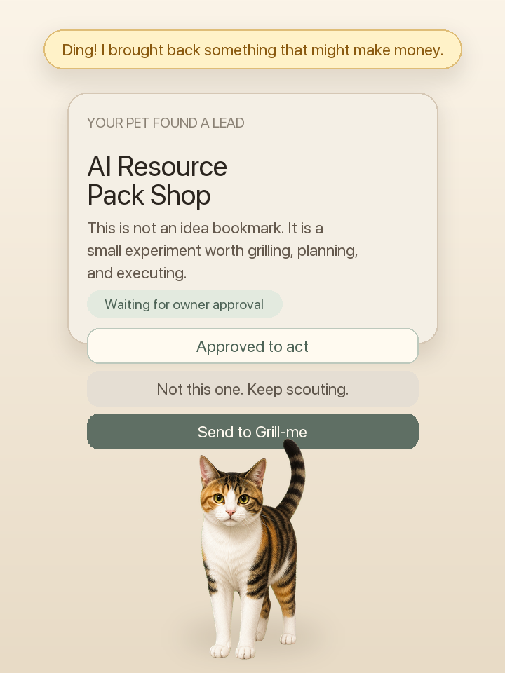

# Opportunity Pet

> Your pet is done lying around at home. Now it wants to make money and take care of you.

Opportunity Pet is a desktop pet that scouts for small, realistic money-making experiments for its owner.

You import your own pet, keep it on your desktop, and let it bring back one practical opportunity at a time: a tiny product, a resource pack, a service workflow, a content experiment, or another small project that might be worth testing.

This is not a normal web app. The browser view is only for development. The intended product experience is a small desktop pet that stays on the user's screen.



## Core Idea

People do not always know what to build, sell, write, package, or test next.

Opportunity Pet turns that vague question into a companion workflow:

```text
desktop pet scouts for opportunities
-> owner approves or asks it to keep scouting
-> Grill-me breaks the approved idea into requirements
-> MAH turns the scope into a route map
-> agents ship, learn from feedback, and keep evolving the project
```

The pet is the emotional interface.  
The opportunity engine is the radar.  
The execution layer turns the idea into next actions.

## Demo Flow

1. The user imports their own pet.
2. The pet appears as a desktop assistant.
3. The pet signals that it found a promising lead.
4. The user can approve it as actionable or ask the pet to keep scouting.
5. Approved ideas go to Grill-me for requirement breakdown.
6. The result can later be handed to MAH as a route map.

## Why This Leads To MAH

The first opportunity should not be a task that a single agent can finish alone.

For this demo, the opportunity is framed as a small AI resource-pack business. It needs several kinds of work:

- research demand signals;
- decide the first niche;
- write and package the resource;
- create the landing or download structure;
- publish to one channel;
- track feedback;
- decide whether to continue, adjust, or stop.

That makes MAH necessary. The pet creates desire and selection. MAH turns the selected opportunity into an ongoing route map.

## What Works Now

- Tauri desktop pet shell based on the original desktop-pet project.
- Desktop pet visual using a custom Tieguo-style asset.
- Entry for importing the user's own pet.
- Opportunity card inside the pet assistant.
- Clear "found a lead" signal.
- Action approval button.
- "Keep scouting" rejection button.
- Grill-me handoff button.
- Plan panel showing how the opportunity can be decomposed.
- Example MAH route map in `examples/mah-routemap.md`.

## What Is Still Prototype

- Imported pet photos are not yet automatically converted into polished desktop-pet sprites.
- Opportunity discovery is currently demo data, not a live multi-source engine.
- MAH route map handoff is represented as structure, not yet connected to a real MAH API.
- The app does not promise real income; it helps frame and execute small earning experiments.

## Opportunity Sources

OSS Goldmine can be one source, but the product should not be limited to GitHub.

Future sources can include:

- open-source demand signals;
- paid template and prompt trends;
- niche content or newsletter opportunities;
- small service gigs;
- automation workflows people already pay for;
- community questions that repeat across platforms.

The product goal is:

```text
find a small earning experiment worth trying, then let MAH keep it moving.
```

## Local Development

Install dependencies:

```bash
npm install
```

Run browser preview:

```bash
npm run dev
```

Run desktop app:

```bash
npm run tauri dev
```

Tauri desktop development requires Rust/Cargo.

## Project Structure

```text
src/
  desktop pet UI and assistant flow

src/components/
  FloatingPet.tsx
  SettingsPanel.tsx
  PlanPanel.tsx

src/lib/
  opportunityDemo.ts

docs/
  workflow.md
  assets/

examples/
  sample-opportunity.json
  mah-routemap.md
```

## Credits

This project continues from the `token-gazer` desktop-pet codebase and repurposes it into an Opportunity Pet prototype for MAH.
